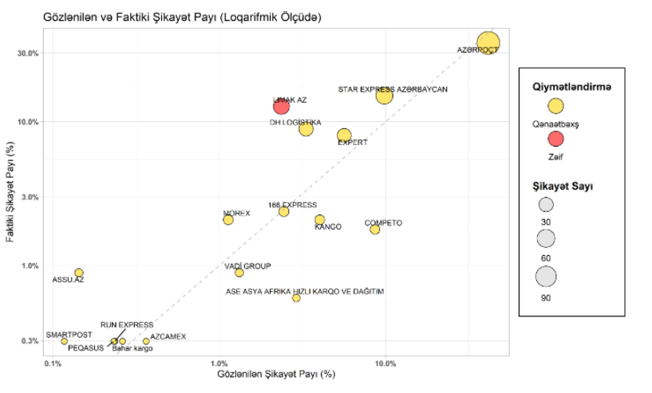

# Postal Operator Complaint Analysis & Visualization

## Overview

This project delivers a robust framework for analyzing and visualizing customer complaints across postal service operators. Using R and advanced data visualization techniques, it empowers regulatory authorities, postal service professionals, and data analysts to objectively assess operator performance, uncover service quality issues, and prioritize regulatory actions based on data-driven insights.

## Features

- **Data Filtering & Processing:**  
  Processes raw complaint and market share data, categorizing postal operators by performance using transparent, customizable thresholds.

- **Performance Index Calculation:**  
  Calculates the difference between expected and actual complaint shares, classifying operators as "Yüksək" (High), "Qənaətbəxş" (Satisfactory), or "Zəif" (Poor) based on their complaint index.

- **Professional Visualizations:**  
  Generates log-log scatter plots comparing expected vs. actual complaint shares, with intuitive color and size coding for operator performance and complaint volume.

- **Customizable & Extensible:**  
  Easily adapt thresholds, visual styles, and data sources for different regulatory environments or reporting requirements.

## Usage

1. **Prepare your data:**  
   Ensure you have a merged dataset containing at least the following columns: `Operator`, `Market_Share`, `Complaint_Share`, `Expected_Share`, `Complaints`.

2. **Render the Report:**  
   Use R Markdown to generate a PDF or HTML report:
   ```r
  Rscript -e "rmarkdown::render('main.Rmd', output_file = 'output/Report.pdf')"
   ```

3. **Interpret the Results:**  
   - Operators above the diagonal line have higher-than-expected complaint shares and may require regulatory attention.
   - Operators below the diagonal exhibit better-than-expected service quality.
   - The legend and visual cues make it easy to identify performance categories at a glance.

## Example Visualization



## Requirements

- R (>= 4.0)
- R packages: `tidyverse`, `ggplot2`, `ggrepel`, `scales`, `rmarkdown`
- LaTeX distribution (for PDF output)

## Project Structure


```
.
├── main.Rmd           # Main R Markdown analysis and visualization script
├── data/              # Data files and sources
├── output/            # Generated reports and figures
├── README.md          # Project documentation
└── (other supporting scripts/files)
```


## License

This project is provided under the MIT License. See [LICENSE](LICENSE) for details.

## Contact

For questions, suggestions, or collaboration, please contact:

- **Samir Orujov**  
  Head of Statistics Division  
  Information Communication Technologies Agency (Telecom regulator of Azerbaijan)  
  salahaddini.ayyubi@gmail.com
